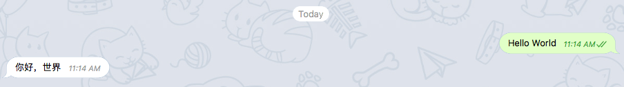
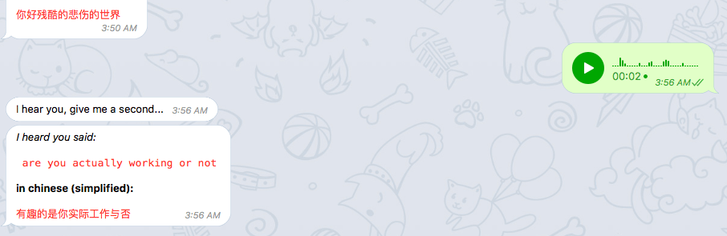

# `Fanyi` Telegram Bot
Translates text and voice notes you send to chinese

## Set up
1. Make sure you create `.env` file with right api keys, etc. See `.env.sample`
2. install dependencies use `yarn` (recommended) (or `npm`)
3. Run the bot, `yarn start` (or `npm start`)

### Google Cloud

Fanyi is very smart thanks to google cloud APIs so make sure you have that set up as well.

- [Translate API](https://cloud.google.com/translate/)
- [Speech API](https://cloud.google.com/speech/)

> 玩的开心! 🎉 😁